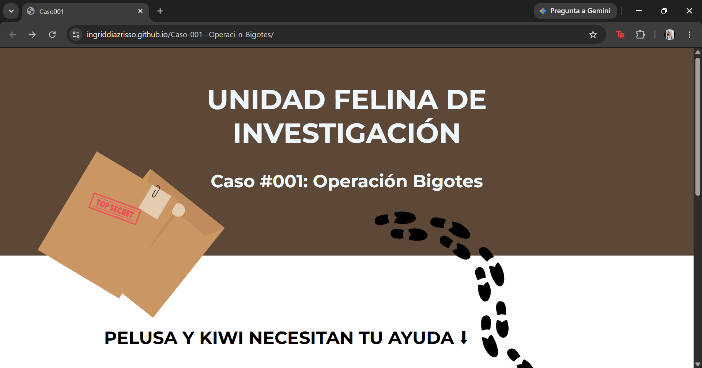
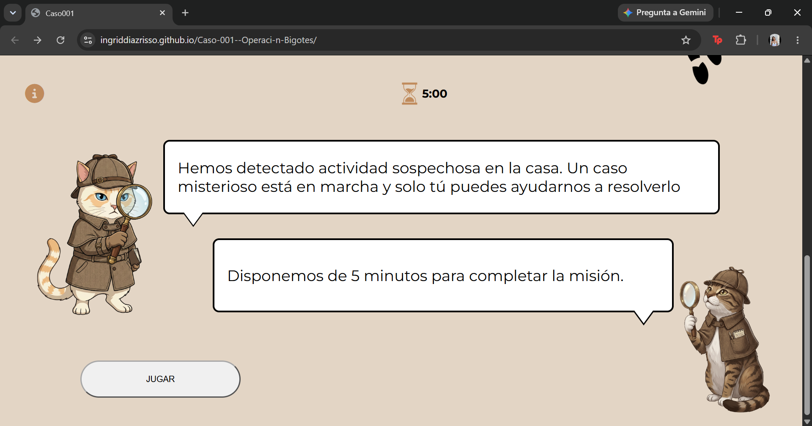
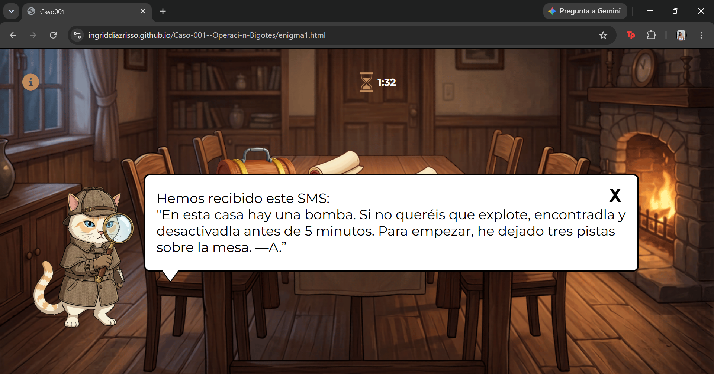
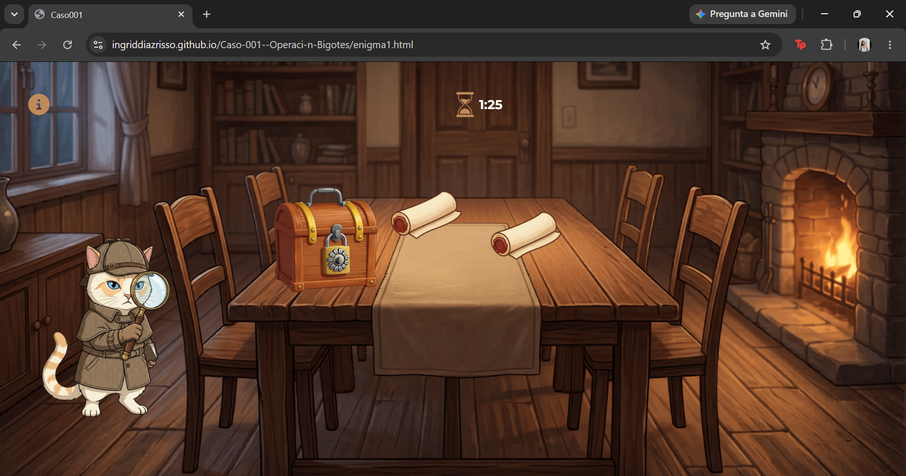
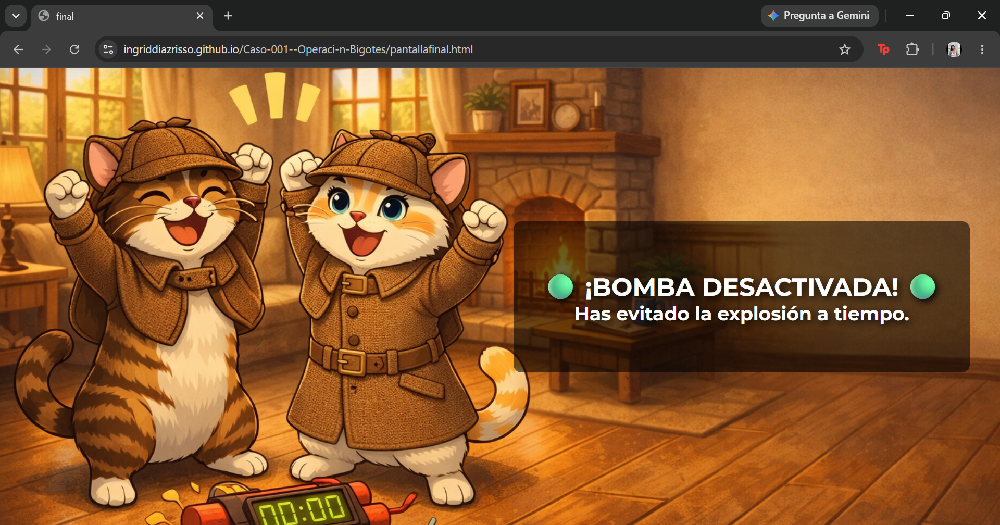

# Caso 001: Operación Bigotes

Escape Room interactivo desarrollado con HTML, CSS y JavaScript.

## Descripción

Proyecto web basado en un Escape Room donde el usuario debe resolver diferentes pruebas y acertijos para avanzar en la investigación y completar la misión.

## Tecnologías

- HTML5

- CSS3

- JavaScript

- LocalStorage

## Funcionalidades

- Navegación entre diferentes fases del juego

- Validación de respuestas y pistas

- Cronómetro de partida

- Persistencia de datos mediante LocalStorage

## Aprendizajes

Durante este proyecto trabajé con:

- Manipulación del DOM

- Gestión de eventos

- Almacenamiento de datos con LocalStorage

- Programación de temporizadores

- Diseño de experiencias interactivas para el usuario

## Demo

https://ingriddiazrisso.github.io/Caso-001--Operaci-n-Bigotes/

## Repositorio

https://github.com/IngridDiazRisso/Caso-001--Operaci-n-Bigotes

## Capturas

### Pantalla inicial

### Escape Room en ejecución

